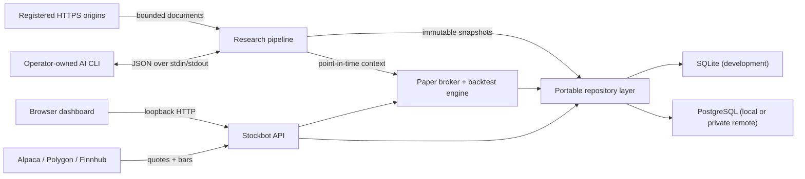

<div align="center">

# Stockbot

### A local-first laboratory for strategies, real market data, and auditable paper trading


**Write a strategy → upload one JavaScript file → test it against real bars → compare it with SPY and Cash.**

</div>

> [!IMPORTANT]
> Stockbot never routes live brokerage orders. Provider credentials retrieve market data only; every order and fill is simulated by the local paper/backtest engine.

## What Stockbot gives you

| Explore | Test | Operate |
|---|---|---|
| Real quotes, OHLCV bars, and optional source-pinned AI research | Deterministic next-bar-open, point-in-time backtests | Durable PostgreSQL or SQLite ledger |
| Searchable equities and interactive charts | Strategy, SPY buy-and-hold, and Cash controls | Loopback-only Express API by default |
| Indicators, market diagnostics, and provider health | Sharpe, drawdown, return, trades, exposure, and more | Risk events, audit history, exports, and recovery |

The same fill model powers backtests and paper sessions. Strategy versions, parameters, bar hashes, slippage, commissions, results, and session events stay attributable and reproducible.

## The five-minute path

### 1. Run Stockbot

Requirements: Node.js 22+, npm, and at least one market-data provider for prices and charts.

```bash
git clone https://github.com/Dankcode/Stockbot.git
cd Stockbot
npm ci
cp .env.example .env
npm run dev
```

Open `http://127.0.0.1:5173`. Development uses SQLite unless `DATABASE_URL` selects PostgreSQL.

### 2. Authorize this browser tab

Generate/configure a 32+ character `STOCKBOT_API_TOKEN`, then paste that same value into **Settings → API mutation token → Set for session**. It stays in that tab's `sessionStorage`, is sent only on mutations, and is never compiled into the frontend.

### 3. Add real market data

In **Settings → Data providers**, configure at least one provider and click **Save group**:

- Alpaca: API key + secret; keep data URL `https://data.alpaca.markets` and feed `iex`
- Polygon: API key
- Finnhub: API key

Stockbot tries **Alpaca → Polygon → Finnhub**. Without credentials, symbol metadata still works, but charts, prices, backtests, and paper fills remain explicitly unavailable—Stockbot never invents candles.

### 4. Plug in a strategy file

1. Open **Strategies** and download **Starter file** (or use [`public/stockbot-strategy-template.js`](./public/stockbot-strategy-template.js)).
2. Rename it and edit its metadata, parameters, and synchronous `signal()` rules.
3. Click **Upload .js**. Stockbot validates the file in a bounded worker, installs it atomically, and stores a source-hashed version.
4. Open the strategy and run a backtest.

No ORM, plugin SDK, package install, or server restart is needed. A strategy is one default-exported JavaScript object:

```js
export default {
  name: "My Strategy",
  params: { period: 20 },
  signal({ index, params, indicators, position }) {
    const average = indicators.sma(params.period);
    if (index < params.period) return null;
    if (position.qty === 0 && average[index] < 100) return "buy";
    if (position.qty > 0 && average[index] >= 100) return "sell";
    return null;
  }
};
```

See the complete [algorithm contract](./algorithms/README.md) before sharing or installing untrusted code.

### Or install a JSON plugin

Uploading `.js` is right for strategies you wrote. For methods **shared between people**, `stockbot.plugin.v1` carries the same logic as data — a frozen rule tree walked by an interpreter with a closed operator set, a node budget, and a nesting cap. No `eval`, no dynamic import, no string ever compiled. The worst a malicious method can do is return a wrong number.

```bash
npm run plugin -- list
npm run plugin -- inspect --plugin horizon-pack
npm run plugin -- requirements --env-file "$HOME/.config/stockbot/stockbot.env"
```

A plugin **declares** what it needs — source ids, secret NAMES, prompt templates, whether an AI CLI is required — and never supplies any of it. Unmet requirements fail loudly at install with the exact remedy, instead of surfacing weeks later as a research-gated strategy that mysteriously never trades. Every `role: "strategy"` method must name its controls or validation rejects the file.

Five bundles ship in `plugins/`: `core-controls`, `base-methods`, `horizon-pack`, `sentiment-pack`, and `gov-research`. All 39 method configurations were verified to reproduce their `.js` originals trade-for-trade. See [Plugin format](./docs/PLUGIN_FORMAT.md).

### 5. Add optional AI research

Stockbot can run strict JSON research plans through two code-owned adapters: a registered-origin HTTPS reader and an operator-configured JSON-in/JSON-out AI CLI. Plans cannot name executables, inject arguments or environment variables, or fetch arbitrary origins. The resulting summaries and source provenance are immutable SQL snapshots that a strategy can read only when they existed by that bar's canonical decision timestamp (`bar.time`).

```bash
npm run research -- adapters
npm run research -- validate --file research-plans/catalyst-composite.json
npm run research:probe -- --symbol NVDA
```

Research is disabled until the server operator configures at least one exact HTTPS origin and an AI CLI. See [AI research](./docs/AI_RESEARCH.md) for the protocol, configuration, import/run commands, and session pinning.

Four plans ship in `research-plans/`: `sec-edgar-filings` (8-K, Form 4, full-text search), `gov-contracts-defense` (daily DoD contract announcements plus USAspending agency activity), `market-news-sentiment` (Nasdaq and Finviz), and `catalyst-composite`, which combines all three and is the one intended for session pinning. The single-source plans exist so you can attribute an edge to a specific source rather than to the bundle. `npm run research:probe` issues one real request per scrape step through the adapter's actual guardrails and names whichever guardrail rejected a source. See [Research sources](./docs/RESEARCH_SOURCES.md) for per-source authorization status and the two documented dead ends — SAM.gov's required API key and FPDS's unsupported content type.

## Tested methods

Every ad-hoc strategy backtest calculates all three methods from real provider bars. Checkmarks in the result panel choose what is visible in the comparison; they do not skip or alter the benchmark calculation.

| Method | Tested by default | Purpose |
|---|:---:|---|
| Uploaded strategy | ✅ | Your exact source version and parameter overrides |
| SPY buy-and-hold | ✅ | Real S&P 500 ETF control over the same requested range |
| Cash | ✅ | Flat `$100,000` control with no market exposure |

Signals are evaluated after bar `N` closes and can fill only at bar `N+1`'s open. A final-bar signal remains unfilled instead of receiving a fabricated price.

Beating SPY and Cash is the floor, not the finding. Three **same-asset** controls ship in `algorithms/` and run as ordinary peer strategies through the identical engine, fill model, and metrics:

| Control file | Question it answers |
|---|---|
| `control-buy-and-hold.js` | Did the rules beat simply owning the symbol they traded? |
| `control-fixed-interval.js` | Or did being in the market ~40% of the time do the work? |
| `control-random-entry.js` | Would *any* information-free schedule have looked the same? |

`control-random-entry.js` is deterministic and seeded, so results stay reproducible and cacheable. Vary `seed` across 10–20 runs and compare the strategy against the resulting distribution rather than one draw — on a 400-bar test series, ten seeds spanned −31% to +160% and one of them beat buy-and-hold outright. See [Control group](./docs/CONTROL_GROUP.md) for the full procedure.

### Horizon pack

Three methods — EMA momentum, RSI mean reversion, Donchian breakout — each scaled to four holding-period horizons, with controls matched to every band:

```bash
npm run horizon:matrix -- --symbol NVDA --range ALL --seeds 20
```

All twelve variants read the same `1day` bars; daily/weekly/monthly/yearly is the target holding period (~2, ~5, ~21, ~252 bars), because the engine has no yearly interval and resampling would change the data as well as the horizon. `control-horizon-fixed.js` and `control-horizon-random.js` take the same `horizon` param so turnover and exposure are matched band by band — comparing a yearly strategy against a daily control measures transaction costs, not skill. See [Horizon pack](./docs/HORIZON_PACK.md).

### Sentiment pack

`sentiment-gated-momentum.js` runs EMA(9/21) entries gated on an archived research snapshot being bullish and confident; `control-sentiment-blind.js` runs the identical rules with the gate removed. The difference between them is the measured value of the entire research pipeline. Pin `news-social-analysis` to the gated session and see [Sentiment pack](./docs/SENTIMENT_PACK.md).

## Choose where data lives

Stockbot uses one repository/migration layer for SQLite and PostgreSQL.

| Deployment | Recommended use | Connection |
|---|---|---|
| SQLite | Fast local development | `file:./data/stockbot.db` |
| Local PostgreSQL | Database on the app machine | `127.0.0.1:5432` |
| Remote/private PostgreSQL | Database on a LAN or private VPN host | Server hostname plus optional direct connect IP |

The dashboard's **Database connection** panel supports:

- Local or remote/private PostgreSQL
- Hostname, port, database, role, and write-only password
- Optional distinct connect address/IP while retaining the hostname for TLS identity
- TLS disabled, required, or certificate-and-hostname verified
- A non-mutating **Test connection** action
- **Save connection**, which validates identity, applies native forward-only migrations, creates the default paper account, and atomically updates the protected host configuration

Saving a new profile does not copy history and requires a Stockbot service restart. Saves are blocked while trading sessions are active.

## Production service on macOS

```bash
npm run laptop:init
npm run laptop:install
npm run laptop:status
```

The initializer creates `~/.config/stockbot/stockbot.env` as mode `0600` without printing generated secrets. The installer runs `npm ci`, lint, tests, build, and database initialization, then stages a private production runtime under:

```text
~/Library/Application Support/Stockbot/app
```

A per-user LaunchAgent keeps the API on `127.0.0.1:4000`. After saving a database profile in Settings, activate it with:

```bash
launchctl kickstart -k "gui/$(id -u)/com.stockbot.laptop"
npm run laptop:status
```

Optional private web/API access can be configured separately:

```bash
npm run laptop:tailscale
```

This maps only Stockbot's loopback HTTP service through private Tailscale Serve. It does not configure, proxy, or publicly expose PostgreSQL, and it never uses Funnel. See [Laptop deployment](./docs/LAPTOP_DEPLOYMENT.md).

## Architecture



## Configuration map

| Variable | Purpose |
|---|---|
| `HOST`, `PORT` | API bind address and port; production forces `127.0.0.1`. |
| `DATABASE_URL` | SQLite file URL or PostgreSQL connection URL. |
| `STOCKBOT_DATABASE_LOCATION` | UI classification: `local` or `remote`. |
| `STOCKBOT_CONFIG_FILE` | Protected writable host env used by the service's database-settings save flow. |
| `STOCKBOT_API_TOKEN` | 32+ character mutation secret entered once per browser tab. Never use `VITE_*`. |
| `STOCKBOT_SETTINGS_KEY` | 32+ character key used to encrypt provider secrets stored in SQL. |
| `ENGINE_WORKERS`, `ENGINE_TIMEOUT_MS` | Strategy worker concurrency and deadline. |
| `QUOTE_FRESHNESS_MS` | Maximum quote age accepted by paper risk checks. |
| `RESEARCH_WEB_SOURCES_JSON` | Code-owned source ids mapped to exact credential-free HTTPS origins. |
| `AI_CLI_COMMAND`, `AI_CLI_ARGS_JSON`, `AI_CLI_MODEL` | Server-owned summarizer executable, fixed argv, and provenance label. |
| `AI_CLI_MAX_INPUT_BYTES`, `AI_CLI_MAX_OUTPUT_BYTES`, `AI_CLI_TIMEOUT_MS`, `AI_CLI_ENV_ALLOWLIST_JSON` | Server-side input/output/deadline caps and explicit credential-name allowlist. |
| `ALPACA_API_KEY`, `ALPACA_API_SECRET` | Alpaca catalogue, quote, and bar access. |
| `POLYGON_API_KEY`, `FINNHUB_API_KEY` | Quote/bar fallbacks. |
| `STOCKBOT_MODE` | Runtime label; production uses `local-paper`. |

Bootstrap values come from the protected env. Provider settings saved in the dashboard are encrypted in SQL. The production database panel atomically updates only its database fields in the protected host env and preserves unrelated secrets.

## Useful operations

```bash
npm run check
npm run db:status -- --env-file "$HOME/.config/stockbot/stockbot.env"
npm run db:trades -- --env-file "$HOME/.config/stockbot/stockbot.env" --account default-paper
npm run research -- adapters --env-file "$HOME/.config/stockbot/stockbot.env"
npm run laptop:status
tail -f "$HOME/Library/Logs/Stockbot/stockbot.error.log"
```

Forward migrations run at startup and through `db:init`. The database stores accounts, sessions, algorithm versions, cached backtests, schedules, simulated orders/fills, position lots, equity snapshots, risk events, alerts, settings, and audit events. Market candles are fetched from providers and held only in short-lived server caches.

## API at a glance

All routes live under `/api/v1` and use validated `{ data, meta }` or `{ error }` envelopes.

| Route group | Responsibility |
|---|---|
| `/health`, `/overview` | Runtime, database/provider health, portfolio, sessions, and risk summary |
| `/market/*` | Search, movers, quotes, provider health, and real bars |
| `/algorithms/*` | Uploads, versions, enablement, and benchmarked backtests |
| `/research/*` | Protected adapter inventory, plan validation/versioning, runs, snapshots, and provenance |
| `/sessions/*` | Draft, start, pause, resume, stop, halt, compare, and export |
| `/accounts/*` | Paper portfolio, simulated orders, liquidation, and account halt |
| `/risk/*`, `/alerts/*` | Risk profiles/events and alert lifecycle |
| `/settings/*` | Provider settings/tests and PostgreSQL profile read/test/save |
| `/stream` | Server-sent session, risk, alert, and market events |

## Guardrails

- The executable broker is the in-process paper broker; no live brokerage order route exists.
- Session modes are restricted to `backtest` and `paper`.
- API and Vite bind to loopback by default.
- Secrets never belong in source control, frontend code, logs, URLs shown to users, or `VITE_*` values.
- Uploaded strategies are constrained and validated, but you should still review code from other people.
- Imported research plans are data, never executable code. The AI CLI emits an inert summary; only a reviewed strategy can convert context into a simulated signal, which still passes through normal risk and fill handling.
- Stockbot is research software, not financial advice.

## Deeper documentation

- [Plugin format — stockbot.plugin.v1](./docs/PLUGIN_FORMAT.md)
- [Plugin surface design system](./docs/PLUGIN_DESIGN_SYSTEM.md)
- [Algorithm format](./algorithms/README.md)
- [Control group and how to read a result](./docs/CONTROL_GROUP.md)
- [Horizon pack — daily/weekly/monthly/yearly with matched controls](./docs/HORIZON_PACK.md)
- [Sentiment pack — news and social, gated vs blind](./docs/SENTIMENT_PACK.md)
- [AI research pipeline](./docs/AI_RESEARCH.md)
- [Research source catalogue](./docs/RESEARCH_SOURCES.md)
- [Laptop deployment](./docs/LAPTOP_DEPLOYMENT.md)
- [Database operations](./docs/DATABASE_OPERATIONS.md)
- [Revision plan and architecture decisions](./docs/plan/00-README.md)

---

<div align="center">

Built for experimentation, reproducibility, and the healthy suspicion that every strategy deserves a benchmark.

</div>
