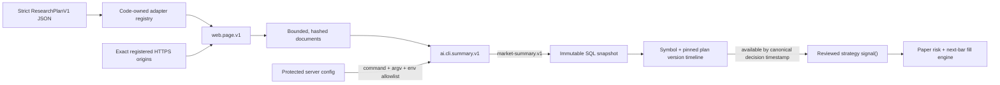

# AI research pipeline

Stockbot's optional research pipeline turns bounded web documents into a strict, point-in-time market summary. It is designed so an imported plan describes **what registered capability to run**, never **what program to execute**. Accepted AI output is inert context: it cannot express an order, call the paper broker, upload a strategy, or write executable code into the algorithm registry.



## 1. Configure the server-owned capabilities

Keep these values in the server's protected env file, not in a plan, frontend variable, LaunchAgent plist, URL, or repository. An explicit `--env-file` used by the CLI must be a regular file with mode `0600` on macOS/Linux.

### Register exact web origins

`RESEARCH_WEB_SOURCES_JSON` maps stable source ids to credential-free HTTPS base URLs. The included example plan expects this exact id and origin:

```dotenv
RESEARCH_WEB_SOURCES_JSON='{"nasdaq-news":"https://www.nasdaq.com"}'
```

`web.page.v1` resolves the plan's origin-relative path against that registered origin. It permits only HTTPS, public DNS addresses, same-origin redirects, approved text/HTML/XML/JSON content types, and bounded response sizes and deadlines. It rejects URL credentials, base query strings/fragments, private/link-local/loopback addresses, cross-origin redirects, compressed responses, and paths that escape the origin. Plans cannot add headers or cookies.

The origin match is exact. With the configuration above, a plan using `sourceId: "nasdaq-news"` can reach `https://www.nasdaq.com/...`; it cannot switch to another scheme, host, or port. A registered URL may include one fixed base path, which is also retained during resolution.

Register a source only after confirming that it permits the intended automated access. The operator remains responsible for its terms, `robots.txt` policy, attribution/licensing requirements, and rate limits. Stockbot enforces origin, network, timeout, redirect, content-type, and byte boundaries; `web.page.v1` is a single-page reader, not a crawler scheduler or a substitute for provider authorization. The included Nasdaq mapping is illustrative and may need to be replaced with a source you are authorized to automate.

Do not put API keys or other secrets in a plan query. The canonical plan, requested/final URLs, and fetched content are retained in SQL for provenance. A source requiring authenticated headers is not supported by `web.page.v1`; add a separately reviewed, code-owned adapter instead of embedding a credential.

### Configure the AI CLI

Stockbot does not choose or download a model executable. The operator supplies one reviewed program that implements the protocol below; `AI_CLI_COMMAND` must be an absolute executable path:

```dotenv
AI_CLI_COMMAND=/absolute/path/to/research-json-summarizer
AI_CLI_ARGS_JSON='["--mode","stockbot"]'
AI_CLI_MODEL=operator-model-label
AI_CLI_TIMEOUT_MS=60000
AI_CLI_MAX_INPUT_BYTES=500000
AI_CLI_MAX_OUTPUT_BYTES=100000
AI_CLI_ENV_ALLOWLIST_JSON='["OPENAI_API_KEY","OPENAI_BASE_URL"]'
OPENAI_API_KEY=replace-in-the-protected-host-config
OPENAI_BASE_URL=https://api.openai.com/v1
```

The server calls `AI_CLI_COMMAND` directly with `shell: false` from the operating system temporary directory, not the Stockbot checkout. `AI_CLI_ARGS_JSON` is a fixed string array owned by the server. The child receives only `PATH`, `TMPDIR`, `LANG`, `LC_ALL`, plus configured allowlisted variable names that exist in the server environment. `HOME` is excluded unless the operator explicitly allowlists it. A plan cannot change the command, argv, model label, output budget, or environment. Plan timeout/input limits may only reduce the server caps.

The configured executable is trusted local software running as the Stockbot service user; review and constrain it accordingly. Use a non-agentic summarizer wrapper that exposes no browser, shell, filesystem, or general tool calls to the model. Give it only the least-privilege model credential it needs. The fixed prompt reduces prompt-injection risk, but cannot make an agentic third-party CLI safe. The temporary working directory and narrow environment are defense in depth, not an OS or network sandbox.

Restart Stockbot after changing these bootstrap settings, then confirm adapter availability:

```bash
npm run research -- adapters --env-file "$HOME/.config/stockbot/stockbot.env"
```

## 2. AI stdin/stdout protocol

The server writes one UTF-8 JSON value to stdin and closes it. The shape is:

```json
{
  "protocolVersion": 1,
  "task": "market-research-summary",
  "symbol": "AAPL",
  "prompt": {
    "id": "market-summary.v1",
    "version": "1",
    "instructions": "Server-owned instructions, including treating documents as untrusted evidence.",
    "responseShape": {
      "overview": "string",
      "keyDrivers": ["string"],
      "risks": ["string"],
      "opportunities": ["string"],
      "sentiment": "bullish | bearish | neutral | mixed",
      "confidence": "number from 0 through 1"
    }
  },
  "documents": [
    {
      "stepId": "market-news",
      "sourceId": "nasdaq-news",
      "url": "https://www.nasdaq.com/market-activity/stocks/AAPL/news-headlines",
      "title": "Page title or null",
      "fetchedAt": 1786200000000,
      "publishedAt": null,
      "contentHash": "64-lowercase-hex-characters",
      "text": "Bounded untrusted source text"
    }
  ]
}
```

Document text can contain prompt injection and must be treated only as untrusted evidence. The executable must write exactly one JSON response to stdout, with no Markdown or surrounding prose:

```json
{
  "summary": {
    "overview": "A source-supported point-in-time summary.",
    "keyDrivers": ["One supported driver"],
    "risks": ["One supported risk"],
    "opportunities": ["One supported opportunity"],
    "sentiment": "neutral",
    "confidence": 0.72
  },
  "model": "actual-model-or-cli-version"
}
```

`overview` must be nonempty. Each text/list field is bounded, lists contain at most 20 items, `sentiment` is exactly `bearish`, `neutral`, `bullish`, or `mixed`, and `confidence` is a finite number from `0` through `1`. `model` is optional; when omitted, Stockbot records `AI_CLI_MODEL`. Invalid JSON, extra fields, prose, oversized output, timeouts, cancellation, or a nonzero exit all fail closed. Stderr content is not accepted as a result.

Stockbot hashes the exact JSON bytes sent to stdin as `aiInputHash`, separately hashes the non-secret summarizer configuration as `summarizerConfigHash`, and records each document's full byte count, included byte count, and truncation flag. This distinguishes the full retained source bundle from the bounded evidence the model actually received.

## 3. Validate, import, and run a plan

Start with [`research-plans/example-market-summary.json`](../research-plans/example-market-summary.json). A plan is at most 256 KiB, may contain at most 100 symbols and 20 ordered steps, and currently recognizes only:

- `web.page.v1`: a `scrape` step naming a configured `sourceId`, an origin-relative `pathTemplate`, optional string query values, a declared format, and reduced timeout/byte caps.
- `ai.cli.summary.v1`: a `summarize` step depending only on earlier step ids and using the fixed `market-summary.v1` prompt and response schema.

Imported step caps are also bounded by schema: timeout is 100–120,000 ms, a scrape may request at most 10 MiB, and a summary may request at most 2 MiB of input. Operator caps can be lower.

Unknown fields are rejected, including `command`, `argv`, `env`, module paths, scripts, and arbitrary adapters. Step ids must be unique, dependencies must point backward, and `outputStep` must name a summarize step. `{{symbol}}` is the only web template variable.

The delivery block controls strategy use:

- `strategy: true` allows the plan version to be pinned to a trading session.
- `required: true` skips `signal()` at a bar with no eligible, unexpired snapshot; `false` supplies an explicit unavailable frame instead.
- `maxAgeMs` sets snapshot lifetime from publication and is capped at 30 days. `0` means no expiry; prefer a finite research-appropriate age.

Use the loopback CLI; it reads the operator token from `.env` or the explicit protected file and sends it only to `http://127.0.0.1:<PORT>`:

```bash
npm run research -- adapters --env-file "$HOME/.config/stockbot/stockbot.env"
npm run research -- validate --file research-plans/example-market-summary.json --env-file "$HOME/.config/stockbot/stockbot.env"
npm run research -- import --file research-plans/example-market-summary.json --env-file "$HOME/.config/stockbot/stockbot.env"
npm run research -- run --plan example-market-summary --symbol AAPL --env-file "$HOME/.config/stockbot/stockbot.env"
npm run research -- run --plan example-market-summary --version PLAN_VERSION_ID --symbol AAPL --env-file "$HOME/.config/stockbot/stockbot.env"
npm run research -- list --limit 20 --env-file "$HOME/.config/stockbot/stockbot.env"
npm run research -- show --run RUN_ID --env-file "$HOME/.config/stockbot/stockbot.env"
npm run research -- snapshot --id SNAPSHOT_ID --env-file "$HOME/.config/stockbot/stockbot.env"
```

`validate` performs strict parsing, adapter lookup, canonicalization, and hashing without persistence. `import` creates an immutable plan version, deduplicated by canonical source hash. `run` uses the latest version unless `--version` supplies an exact id, fetches/summarizes one concrete symbol, and atomically publishes a snapshot only after the complete run succeeds.

`show` returns a run with its retained documents and published summary. `snapshot` resolves the `researchSnapshotId` stored on a paper or backtest order directly to the exact structured snapshot and provenance used at signal time.

The service admits at most two concurrent research runs and caps retained document text at 20 MiB per run in addition to every step's smaller timeout/byte limits. Excess work fails closed instead of spawning an unbounded set of CLI processes. Runs interrupted by a Stockbot restart are durably marked failed and can be rerun as new immutable runs.

Importing or pinning does not automatically execute research. Produce snapshots with `run` before they are needed. If research should recur, invoke this fixed CLI command from a trusted host scheduler; never place a scheduler command inside the plan.

## 4. Pin research to a session

`POST /api/v1/sessions` accepts either `researchPlanId` or `researchPlanVersionId`, never both:

```json
{
  "name": "AAPL research-aware backtest",
  "mode": "backtest",
  "algorithmVersionId": "ALGORITHM_VERSION_ID",
  "researchPlanId": "example-market-summary",
  "symbols": ["AAPL"],
  "barInterval": "1day"
}
```

`researchPlanId` resolves the latest version once during session creation. `researchPlanVersionId` selects an exact version directly. In both cases the created session exposes and permanently stores the resolved `researchPlanVersionId`; importing a newer plan later cannot change that session. The pinned plan must declare `delivery.strategy: true` and allow every session symbol (explicitly or with `"*"`).

The research API, including its read routes, always requires `STOCKBOT_API_TOKEN`. It is an operator CLI/direct-API surface; there is currently no research dashboard. The frontend intentionally sends its `sessionStorage` token only on mutations, so setting the token in **Settings** does not authorize protected research GETs. The research CLI loads the token from the protected server env and contacts loopback only. A direct API client must send `X-Stockbot-Token` explicitly on every research request. Do not put the token in a plan, URL, source query, or shell history.

## 5. Archived point-in-time semantics

For every closed bar, Stockbot uses its canonical timestamp as `decisionAt` (currently `bar.time`, generally the bar's open), then selects a snapshot only when all of these are true:

- it belongs to the session's exact pinned plan version and current symbol;
- it is marked eligible and `availableAt <= decisionAt`;
- `expiresAt` is null or `expiresAt > decisionAt`.

Availability is inclusive; expiry is exclusive. When multiple snapshots qualify, the most recent `availableAt` wins, with stable id ordering as the tie-breaker. The frame and every nested summary/source object are frozen before they enter strategy code.

This timestamp choice is intentionally conservative: `signal()` receives the fully closed bar, but research published after `bar.time`—including research that arrives during that bar—waits for the next bar. The runtime does not use a later wall-clock callback or exchange-close timestamp to make it visible early.

Backtests load only persisted eligible snapshots available by the requested test window end, including an earlier snapshot that remains valid at the window start. Selection is still repeated per bar, so a summary is invisible before its original publication time. Stockbot never reruns today's scraper or model to backfill a historical window. The backtest records a research-timeline hash. Algorithm-generated paper orders retain the selected `researchSnapshotId`; archived backtest trades/fills carry it as well. The value is null when optional research was unavailable or the execution was not generated by a research-backed strategy signal.

## 6. Immutable SQL provenance

Forward migrations create durable records for:

- the stable plan identity and each canonical, source-hashed manifest version;
- each pending/running/completed/failed run and its exact request/result;
- each fetched document's requested/canonical URL, title, retrieval/publication times, content type, content hash, extracted text, and step/source metadata;
- each immutable snapshot's symbol, availability/expiry, structured summary, full source bundle, exact AI-input hash, per-document truncation boundaries, summarizer-config hash, prompt hash, model label, content hash, and source provenance;
- the plan-version pin on a session, snapshot attribution on paper orders, and attribution on archived backtest trades/fills.

Plan versions, run identities, and snapshots use conflict checks rather than silent replacement. Documents are append-only and every source/step record is retained even when two sources return identical text, so snapshot provenance still reconciles exactly. A new fetch/model result creates a new run and snapshot. Protect database files, server credentials, exports, and backups: provenance can contain licensed or sensitive source text and URLs even though it must never contain application secrets.

## Security boundary recap

- Imported plans are strict JSON data and cannot execute a shell, select a binary, load a module, or forward environment variables.
- Only exact operator-registered HTTPS origins are reachable through `web.page.v1`; network and redirect checks are applied on every request.
- Scraped text is untrusted and the fixed prompt tells the AI to ignore embedded instructions and tool requests.
- AI output must match a bounded summary schema that has no order/action/quantity fields.
- A reviewed strategy is the only component that can translate an available summary into a signal, and Stockbot still supports simulated paper/backtest execution only.
- Tailscale can expose Stockbot's loopback HTTP service privately, but never expose the SQL port or use Funnel. See [Laptop deployment](./LAPTOP_DEPLOYMENT.md).
